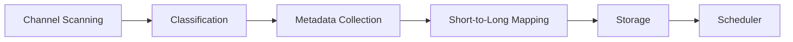

# Architecture Overview

This document outlines the main modules and data flow of the YouTube Scanner system.

## Module Responsibilities

- **Channel Scanning**: Enumerates configured channels and retrieves video identifiers. Logs channel progress and any API failures.
- **Classification**: Distinguishes Shorts from long-form videos using duration and URL patterns. Records classification decisions and flags anomalies.
- **Metadata Collection**: Gathers detailed statistics, descriptions and transcripts for target videos. Errors retrieving metadata are logged for retry.
- **Short-to-Long Mapping**: Links Shorts to corresponding long-form videos via description links, comments and transcript matching. Mapping results and mismatches are logged.
- **Storage**: Persists metadata and mapping results to structured storage such as a database or file system. Failed writes are reported upstream.
- **Scheduler**: Orchestrates periodic scans and updates. Aggregates logs from all modules and handles retry or alerting on errors.

## Data Flow

## Logging and Error Handling

Logging is centralized so each module emits structured entries that trace the pipeline. Error handling follows the data flow: a module logs the issue, returns contextual information, and the scheduler decides on retries or alerts.

- Channel scanning logs unavailable channels or quota errors and continues with the next target.
- Classification logs invalid or missing durations and marks videos for review.
- Metadata collection logs API failures and records placeholders until data can be refreshed.
- Mapping logs unresolved Shorts, which remain in storage with a "no match" status.
- Storage logs write failures and surfaces them to the scheduler.
- Scheduler summarizes errors across modules and schedules follow-up jobs or notifications.

