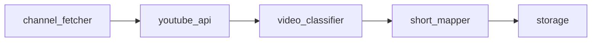

# Architecture Overview

This document outlines the modules that make up the YouTube Scanner and how they work together.

## Module Layout

- `youtube_scanner.channel_fetcher` – retrieves videos for a channel via the YouTube Data API.
- `youtube_api` – requests detailed metadata for individual videos.
- `youtube_scanner.video_classifier` – labels each video as a Short or long-form item.
- `youtube_scanner.short_mapper` – attempts to pair Shorts with matching long-form videos.
- `storage` – stores run metadata such as the last time a channel was scanned.
- `scheduler` – triggers periodic scans and coordinates retries.

## Workflow

1. `scheduler` invokes `channel_fetcher` for each configured channel.
2. For every video ID returned, `youtube_api` gathers metadata used by `video_classifier` to detect Shorts.
3. `short_mapper` tries to link each Short to a long-form counterpart.
4. Results and timestamps are persisted via `storage`.

## Data Flow

## Logging and Error Handling

Logging is centralized so each module emits structured entries that trace the pipeline. The scheduler reviews errors and decides whether to retry or surface alerts.

- `channel_fetcher` logs unavailable channels or quota errors and continues with the next target.
- `video_classifier` logs invalid or missing durations and marks videos for review.
- `youtube_api` logs API failures and records placeholders until data can be refreshed.
- `short_mapper` logs unresolved Shorts, which remain in storage with a "no match" status.
- `storage` logs write failures and surfaces them to the scheduler.
- `scheduler` summarizes errors across modules and schedules follow-up jobs or notifications.

